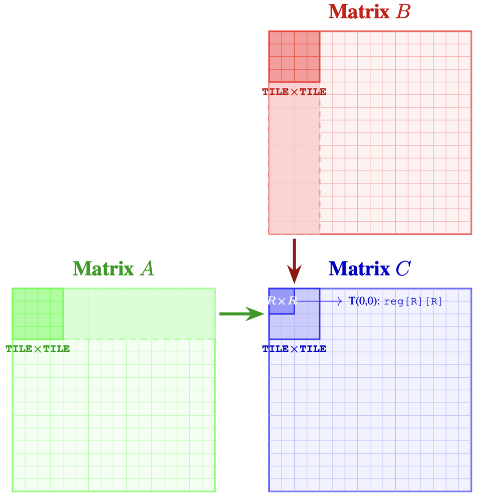
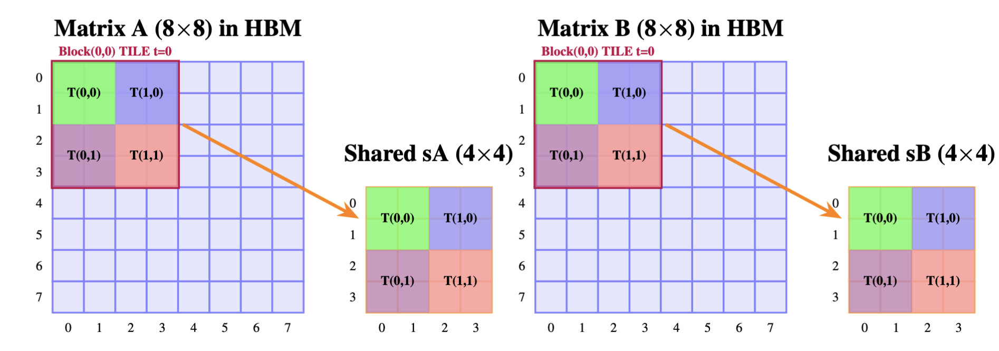
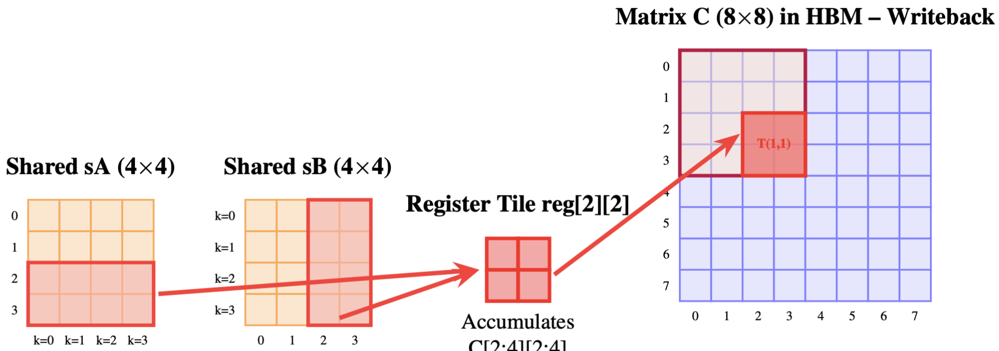

# 2D Tiling in Matrix Multiplication

Efficient matrix multiplication on GPUs relies on reducing global memory traffic and increasing data reuse. Previously, you explored several tiling strategies in which each thread computed either one or a few elements of the output matrix by loading data cooperatively into shared memory. This assignment extends that progression to a fully 2D register-blocked design, where each thread computes an entire $R \times R$ sub-block of the output matrix, maximizing data reuse from both shared memory tiles simultaneously. This design improves arithmetic intensity by:

1. Loading tiles of $A$ and $B$ into shared memory.
2. Reusing those tiles across multiple multiply–accumulate operations.
3. Accumulating results in per-thread registers before writing to global memory.

You are given the file `student.cu` in this directory.
It contains:

- `main()` (testing infrastructure),
- `matmul_gpu_block2d()` (kernel launch wrapper), and
- The signature of the CUDA kernel that you must implement.

---

## Background

### Problem Setup

Given two square matrices $A, B \in \mathbb{R}^{N \times N}$, compute:

$$
C = A \times B,
$$

where

$$
C[i,j] = \sum_{k=0}^{N-1} A[i,k] \cdot B[k,j],
\qquad 0 \le i,j < N.
$$

All matrices are stored in **row-major flattened format**.

### Kernel Design Overview

Let:

- `TILE` be the shared-memory tile dimension.
- `R` be the compile-time register block size.

Each thread computes an $R \times R$ sub-block of $C$ entirely in registers. Therefore:

- Each thread block computes a $\mathtt{TILE} \times \mathtt{TILE}$ tile of $C$.
- The block dimension is:

$$
\left(\frac{\mathtt{TILE}}{R}\right)
\times
\left(\frac{\mathtt{TILE}}{R}\right).
$$

### Shared Memory Layout

A single dynamically allocated shared-memory buffer is used:

```cpp
extern __shared__ float s[];
float* sA = s;                // TILE * TILE floats
float* sB = s + TILE*TILE;    // TILE * TILE floats
```



Both `sA` and `sB` are treated as row-major $\mathtt{TILE} \times \mathtt{TILE}$ arrays.

### Thread Responsibilities

Let `(tx, ty)` denote the thread coordinates inside a block.

Each thread computes an $R \times R$ output sub-block beginning at:

$$
\begin{aligned}
\mathtt{rowBase} &= \mathtt{blockIdx.y} \times \mathtt{TILE} + \mathtt{ty} \times R, \\
\mathtt{colBase} &= \mathtt{blockIdx.x} \times \mathtt{TILE} + \mathtt{tx} \times R.
\end{aligned}
$$

Each thread must:

- Maintain a register tile:

  ```cpp
  float reg[R][R];
  ```

  initialized to zero.
- Load an $R \times R$ sub-block of $A$ into `sA`.
- Load an $R \times R$ sub-block of $B$ into `sB`.
- Accumulate into `reg`.
- Write the results back to global memory.

### Tiling Along the K Dimension

The multiplication proceeds over tiles along the shared $K$ dimension. The number of tiles is:

$$
\texttt{numTiles} = \frac{N}{\mathtt{TILE}}.
$$

For each tile index $t$, the block cooperatively loads one tile of $A$ and one tile of $B$ into shared memory.

#### Loading Tile of $A$

Each thread is responsible for loading an $R \times R$ sub-block of the current A-tile into shared memory. As shown in the visualization, each thread uses its $(\mathtt{tx}, \mathtt{ty})$ coordinates, computes the starting global row using $\mathtt{rowBase}$, and the starting global column inside the current K-tile, and loads its $R \times R$ patch into the correct location in $\mathtt{sA}$. The following visualization demonstrates this process.



#### Loading Tile of $B$

Similar to above, each thread loads an $R \times R$ sub-block of the current B-tile into shared memory.

After loading both tiles, call:

```cpp
__syncthreads();
```

#### Compute Phase

Each thread multiplies the two shared-memory tiles and accumulates results into is private register tile. Basically, for each position within the tile width, load one value from the shared memory corresponding to one row of this thread's $R \times R$ output tile from $\mathtt{sA}$, multiply it with the corresponding column values from $\mathtt{sB}$ and accumulate the products.

Then call `__syncthreads()` before proceeding to the next tile.



### Final Write-Back

After all tiles have been processed, each thread writes its $R \times R$ register block into the correct position of global memory using $\mathtt{rowBase}$ and $\mathtt{colBase}$.

## Task

Implement the kernel:

```cpp
template<int R>
__global__ void matmul_tiled_block2d_kernel(
    const float* A,
    const float* B,
          float* C,
    int N,
    int TILE
)
```

- `R` = compile time register tile size (number of output rows/cols per thread).
- `A, B` = input matrices in row-major flattened format ($N \times N$).
- `C` = output matrix in row-major flattened format ($N \times N$).
- `N` = side length of all three matrices.
- `TILE` = tile size; the block dimension is $(\mathtt{TILE}/R) \times (\mathtt{TILE}/R)$.

**Requirements:**

- Use `extern __shared__` memory and partition it into `sA` and `sB`.
- Declare and zero-initialize `float reg[R][R]`.
- Compute `rowBase` and `colBase`.
- Loop over all $K$-dimension tiles.
- Perform cooperative loading into shared memory.
- Synchronize correctly.
- Accumulate values into registers.
- Write final results to global memory.

## Testing

The provided test:

- Computes a CPU reference result.
- Launches your kernel via `matmul_gpu_block2d`.
- Compares results element-wise.

A test case receives PASS only if **all** elements satisfy the following criteria:

$$
|C_{\text{CPU}} - C_{\text{GPU}}| < 10^{-3}.
$$
