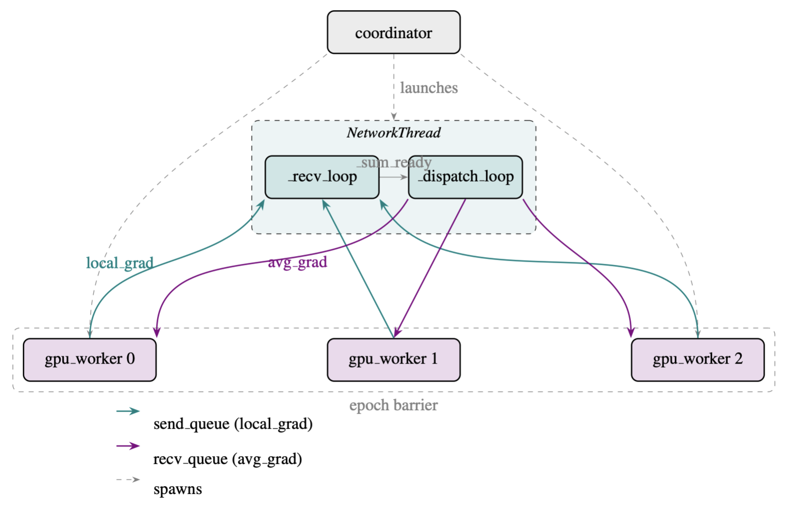

# Data Parallelism

This assignment implements a simulated version of **data-parallel training** for a two-layer MLP. A pre-implemented `MLP` class (forward pass, loss, backprop, and SGD update) is already provided in `mlp.py` — you do not need to modify it. Your task is to build the multi-process, multi-thread simulation that trains multiple replicas of this MLP in parallel and keeps them synchronised using a centralised **AllReduce**.

All code should be implemented in the provided skeleton file, **`student.py`**, which contains `TODO` markers indicating the sections you must complete.

---

## Background

Modern deep learning models are frequently trained across multiple GPUs using **data parallelism**: each GPU holds an identical copy of the model and processes a different mini-batch of data. After each forward and backward pass, the locally computed gradients must be averaged across all GPUs so that every replica applies the same parameter update and the copies remain in sync. This gradient-averaging step is called an **AllReduce**.

In this task, you will implement a simulated version of data-parallel training for a two-layer MLP. A central `NetworkThread` object plays the role of the network switch: it collects one gradient vector from every simulated GPU, averages them, and broadcasts the result back.

> **Note:** This task relies on the `MLP` class, which is already implemented in `mlp.py` (forward pass, MSE loss, backpropagation, and `apply_gradients`). You can treat it as a black box exposing `forward(X)`, `loss(logits, Y)`, `backward(cache, Y)`, `params_flat()` / `set_params_flat(flat)`, and `apply_gradients(flat_grad, lr)`.

### System Architecture

The simulation involves three types of concurrent actors:

| Component | Role |
|---|---|
| `gpu_worker` (Process) | One `Process` per simulated GPU (rank `0 … N-1`). Each worker owns a private `MLP` replica and the mini-batches differ across GPUs. |
| `NetworkThread` (Thread) | A single server that aggregates incoming gradient vectors, computes the element-wise mean, and sends the averaged gradient out to every GPU. It internally spawns two daemon threads: a receive loop and a dispatch loop. |
| `coordinator` (main process) | Launches the `NetworkThread` and all `gpu_worker` processes, then waits for them to finish and prints communication statistics. |

### Training Loop (One Epoch, One GPU)

Each `gpu_worker` executes the following sequence every epoch:

1. Sample a local mini-batch `(X, Y)` using its private random number stream.
2. Run **forward pass**: `model.forward(X)` → `(logits, cache)`.
3. Compute **loss**: `model.loss(logits, Y)`.
4. Run **backward pass**: `model.backward(cache, Y)` → `local_grad`.
5. **Send** `local_grad` to the `NetworkThread`.
6. **Receive** the averaged gradient `avg_grad` back from the `NetworkThread`.
7. **Apply** `avg_grad` to update model parameters.
8. **Synchronise** with all other GPUs at the epoch barrier.

#### Architecture Diagram



### AllReduce Protocol

The `NetworkThread` implements a centralised AllReduce:

1. **Receive loop** collects gradient vectors one at a time from `send_queue` and accumulates them into a running sum `g_sum`.
2. Once all `N` gradients have arrived, the loop signals `_sum_ready`.
3. **Dispatch loop** wakes on `_sum_ready`, computes

   ```
   ḡ = g_sum / N
   ```

   and pushes `ḡ` to every GPU's `recv_queue`.
4. Both buffers and the ready event are reset for the next round.

---

## Task

### Code Provided

The `student.py` skeleton contains the `MLP` class along with the main skeleton and all `TODO` markers you must complete.

### Task Description

Open `student.py` and complete every section marked `# TODO`. There are **three sets** of TODOs. Use the descriptions below to complete them.

#### `NetworkThread._recv_loop()`

1. Block-wait on `self.send_queue` to receive the next item; exit the loop when `None` is received (shutdown signal).
2. After sleeping for the simulated transfer time, accumulate the received gradient into `self._sum_buffer`, increment `self._contributions`, and update `total_bytes_transferred` and `total_sim_time`.
3. When `self._contributions == self.n`, set the `self._sum_ready` event to wake the dispatch loop.

#### `NetworkThread._dispatch_loop()`

1. Block until `self._sum_ready` is set.
2. Compute the averaged gradient: `avg_grad = _sum_buffer / n`.
3. Push a copy of `avg_grad` to every entry in `self.recv_queues`.
4. Reset `_sum_buffer` to zeros, reset `_contributions` to zero, and clear the `_sum_ready` event.

#### `gpu_worker()`

1. Push the tuple `(rank, local_grad)` onto `send_queue` to send the local gradient to the `NetworkThread`.
2. Block on `recv_queues[rank]` to receive the averaged gradient.
3. Call `model.apply_gradients(avg_grad)` to update the local model replica.

### Concurrency Notes

- **Thread-based receive and dispatch loops with locking.**
  `_recv_loop` and `_dispatch_loop` each run in their own `threading.Thread`, meaning they execute concurrently alongside the main thread. A `threading.Thread` is a lightweight execution unit that shares the same memory space as its parent process. Here, the mutable variables `_sum_buffer` and `_contributions` can be read or written by either loop at any moment, so accesses are wrapped with `self._lock`, a `threading.Lock`. Acquiring a lock (`with self._lock:`) ensures mutual exclusion: only one thread may execute the protected block at a time, preventing torn reads, partial writes, and data races. The skeleton code acquires the lock for you wherever it is needed, so you do not need to add additional lock calls — only fill in the guarded logic correctly.

- **`_sum_ready` as a threading event for signalling.**
  `_sum_ready` is an instance of `threading.Event`, which is a simple flag that threads can use to communicate state changes without polling. Internally it holds a boolean that starts as unset (`False`). Calling `.set()` raises the flag and immediately unblocks any thread currently waiting on it; calling `.wait()` blocks the calling thread until the flag is set, avoiding a busy-wait spin loop; and calling `.clear()` resets the flag back to the unset state so it can be reused in the next cycle. In this codebase, `_sum_ready` coordinates the moment when an accumulated partial sum is ready for consumption: one thread sets it to signal completion, another waits on it to proceed, and clear prepares the event for the following round. Use only these three methods — do not inspect or manipulate the internal flag directly.

- **GPU workers as separate processes communicating through queues.**
  Each `gpu_worker` function is launched as a `multiprocessing.Process`, which creates a fully independent operating-system process with its own Python interpreter and private memory space. Unlike threads, processes do not share memory by default, which eliminates entire categories of data races but also means ordinary variables cannot be passed between them. All inter-process communication must go through `multiprocessing.Queue` objects: a queue provides a thread-safe and process-safe FIFO channel where one side calls `.put(item)` to enqueue data and the other calls `.get()` to dequeue it. Do not attempt to pass results via shared Python objects, module-level variables, or `multiprocessing.Value` / `Array` shared memory — the design of this system assumes queues as the only IPC mechanism, and bypassing that assumption will introduce synchronisation bugs that are difficult to diagnose.

- **The `Barrier` for epoch-boundary synchronisation only.**
  A `multiprocessing.Barrier` (or `threading.Barrier`) is another primitive: each participating worker calls `barrier.wait()`, and every caller blocks until all `N` parties have arrived, at which point all are released simultaneously. This guarantees that no worker begins the next epoch before every other worker has finished the current one — a critical invariant when gradients or partial sums from one epoch must not flow into the next. In this codebase the `Barrier` is used exclusively at the end of each epoch for this purpose. Do not insert additional `barrier.wait()` calls elsewhere in your implementation: spurious barrier calls will cause workers to block indefinitely if the expected number of participants never arrives, producing a deadlock.

---

## Testing

A **serial baseline** (`run_baseline`) performs the identical computation sequentially: it loops over ranks, collects local gradients, computes `np.mean(grads, axis=0)`, and applies the averaged gradient. Your distributed implementation must produce numerically identical results.

Run the correctness check with:

```bash
python3 student.py --check
```
