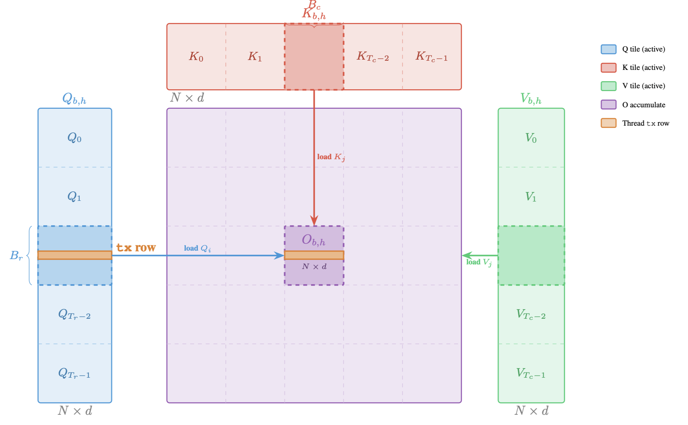

# Flash Attention

Transformer models rely heavily on scaled dot-product attention, which has quadratic memory and compute complexity in sequence length. **Flash Attention** is an optimized algorithm that reduces memory usage and improves efficiency by computing attention in a tiled manner using on-chip shared memory.

You have been given the file `student.cu` in this directory. It contains the main function with test cases, the host-side launcher, the CPU reference implementation, and one kernel function signature that you need to implement.

---

## Background

Given the query, key, and value tensors:

$$Q, K, V \in \mathbb{R}^{B \times H \times N \times D}$$

where:
- $B$ is the batch size,
- $H$ is the number of attention heads,
- $N$ is the sequence length,
- $D$ is the head dimension,

the standard attention output is:

$$O = \text{softmax}\left(\frac{QK^\top}{\sqrt{D}}\right)V$$

However, directly computing this requires materializing the full $N \times N$ attention matrix. FlashAttention avoids this by computing attention in **tiles**.

---

## Task

### Formulation

We divide the sequence into tiles and compute attention incrementally.

Let:

$$Q_i \in \mathbb{R}^{B_r \times D}, \quad K_j, V_j \in \mathbb{R}^{B_c \times D}$$

For each pair of tiles $(i, j)$, we compute the score matrix:

$$S_{ij} = Q_i K_j^\top \cdot \text{scale}, \quad \text{where } \text{scale} = \frac{1}{\sqrt{D}}$$

Each row of $S_{ij}$ corresponds to attention scores for one query vector against all keys in the tile.

To compute softmax in a numerically stable way, we maintain:

- $m_i \in \mathbb{R}^{B_r}$: running maximum per row
- $\ell_i \in \mathbb{R}^{B_r}$: running normalization factor per row

Define:

$$m_{ij} = \max_{\text{columns of } S_{ij}} S_{ij}$$

which is a vector of size $B_r$ containing the row-wise maximum of the current tile.

We update the running maximum:

$$m_i^{\text{new}} = \max(m_i^{\text{prev}}, m_{ij})$$

Then update the normalization factor:

$$\ell_i^{\text{new}} = e^{m_i^{\text{prev}} - m_i^{\text{new}}} \cdot \ell_i^{\text{prev}} + e^{m_{ij} - m_i^{\text{new}}} \cdot \sum_{\text{columns}} e^{S_{ij} - m_{ij}}$$

This ensures numerical stability by always subtracting the row maximum before exponentiation.

The output is updated incrementally as follows.

Let:

$$P_{ij} = e^{S_{ij} - m_{ij}}$$

Then the contribution of tile $j$ to the output is:

$$\tilde{O}_{ij} = P_{ij} V_j$$

We combine this with the previous output:

$$O_i^{\text{new}} = \frac{O_i^{\text{prev}} \cdot \ell_i^{\text{prev}} \cdot e^{m_i^{\text{prev}} - m_i^{\text{new}}} + \tilde{O}_{ij} \cdot e^{m_{ij} - m_i^{\text{new}}}}{\ell_i^{\text{new}}}$$

This formula ensures that the final result is equivalent to the full softmax attention without explicitly forming the full attention matrix.



### Thread Mapping

Kernel launch:

```
dim3 grid(B, NH);
dim3 block(Br);   // 32 threads
```

- Each block handles **one $(b, h)$ pair**
- Each thread is responsible for computing one row of the output $O_i$, which corresponds to one query vector. It processes all key/value tiles sequentially and maintains its own running softmax statistics ($m_i$, $\ell_i$).

```
int b = blockIdx.x;
int h = blockIdx.y;
int tx = threadIdx.x;
```

- One thread = one query row
- That thread computes the entire softmax and output for that row

### Shared Memory Layout

You are given a single shared memory buffer:

```
extern __shared__ float smem[];
```

Partition it as follows:

```
float* Qi = smem;
float* Kj = Qi + Br * D;
float* Vj = Kj + Bc * D;
float* S  = Vj + Bc * D;
```

- $Qi$: current query tile
- $Kj, Vj$: current key/value tile
- $S$: attention scores ($B_r \times B_c$)

You are given a CUDA file containing:

- Memory allocation and initialization
- Kernel launch configuration
- A partially implemented kernel:

### Kernel: `flash_forward_kernel`

**Function signature:**

```
__global__ void flash_forward_kernel(
    const float* Q,
    const float* K,
    const float* V,
    int B, int NH,
    int N, int D,
    int Tc, int Tr,
    int Bc, int Br,
    float softmax_scale,
    float* l,
    float* m,
    float* O
)
```

### Parameters

- `Q, K, V`: Input tensors of shape $[B, H, N, D]$ (flattened).
- `O`: Output tensor of the same shape.
- `l`: Row-wise normalization factors.
- `m`: Row-wise maximum values.
- `Tc`, `Tr`: Number of tiles along the key and query dimensions.
- `Bc`, `Br`: Tile sizes.
- `softmax_scale`: Scaling factor $1/\sqrt{D}$.

### Requirements

We now describe the computation performed by each thread, following the exact structure of the kernel implementation.

#### Step 1: Iterate Over Key/Value Tiles (Outer Loop)

Each thread block processes one $(b, h)$ pair. The kernel first iterates over all key/value tiles. In each iteration, threads load one tile of keys and one tile of values from global memory into shared memory. Each thread is responsible for loading one row of these tiles across all feature dimensions, followed by synchronization to ensure all data is available.

#### Step 2: Iterate Over Query Tiles and Load Data

For each key/value tile, the kernel iterates over all query tiles. In this inner loop, threads load the current query tile into shared memory. Each thread corresponds to a specific row within the query tile and is responsible for processing that row. The thread also loads its corresponding running statistics (maximum and normalization factor) from global memory.

#### Step 3: Compute Attention, Update Statistics, and Accumulate Output

Each thread computes attention scores between its query row and all keys in the current tile, applies scaling, and stores intermediate results in shared memory. It then determines the maximum score, exponentiates the shifted scores, and accumulates their sum. Using these values, the thread updates its running maximum and normalization factor using the online softmax update rule. Next, it computes the contribution of the current tile to the output by combining the attention weights with the value vectors. The previous output is rescaled appropriately and combined with the new contribution, and the result is normalized using the updated normalization factor.

#### Step 4: Write Back Results

After processing the current query tile, each thread writes the updated running maximum and normalization factor back to global memory. The output vector is also updated in global memory. This process continues across all tiles, and by the end of execution, the output tensor contains the final attention results.

## Testing

- Each test case runs the GPU kernel and compares its output element-wise against the CPU reference implementation.
- A test case passes only if all output elements match within a tolerance of $\epsilon = 10^{-4}$.
- Results are reported as `PASS` or `FAIL` for each configuration.
