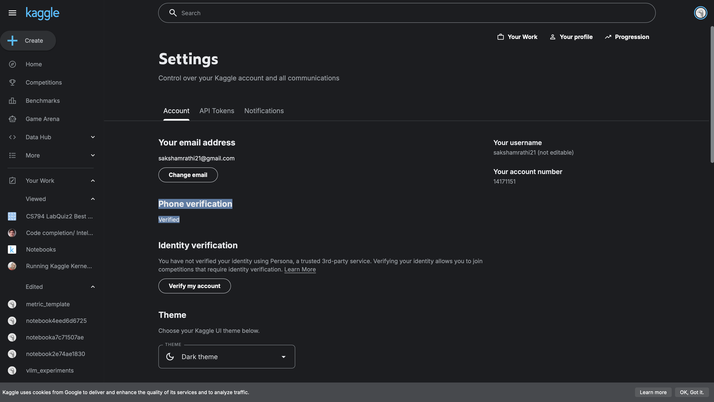
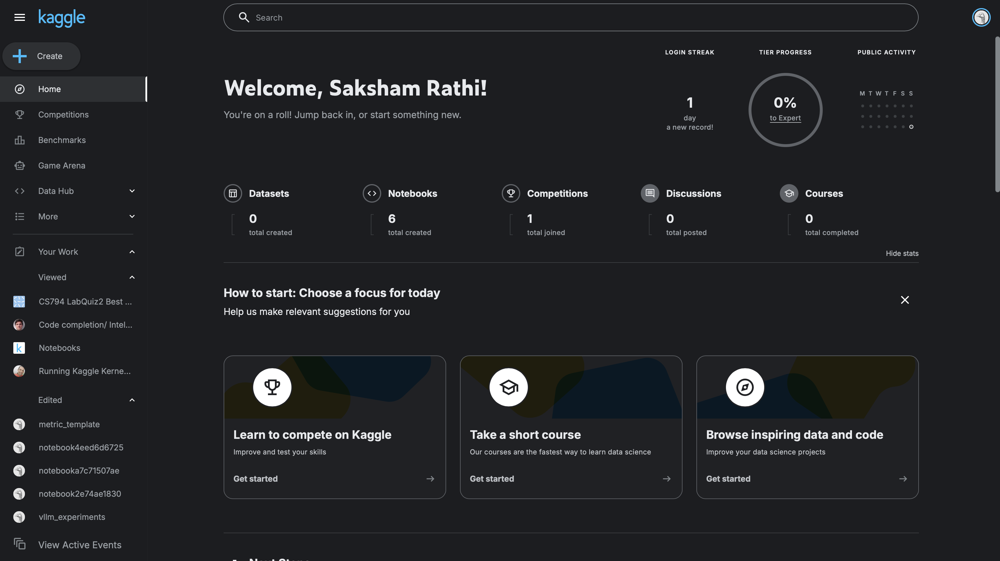
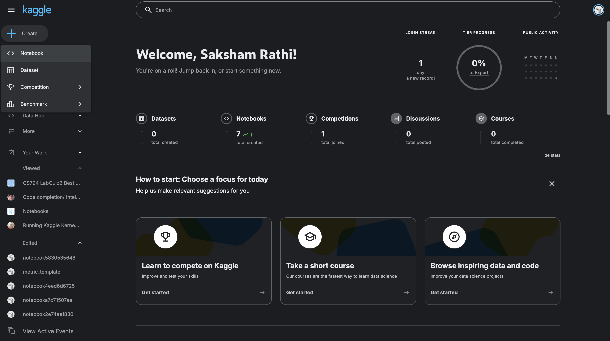
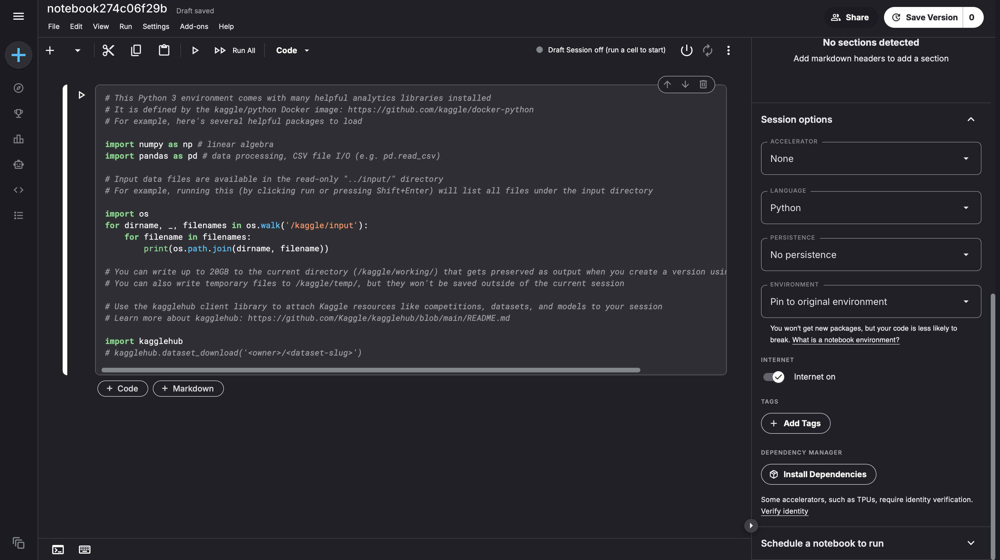
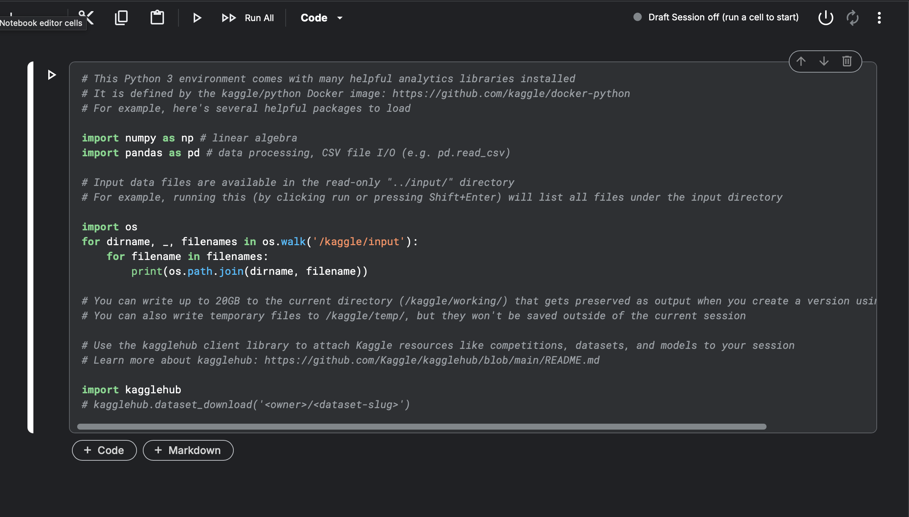
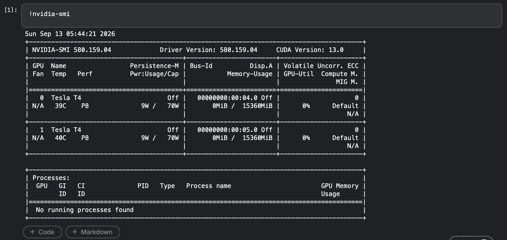

# Kaggle Setup Guide

This guide walks you through everything you need to get started with **Kaggle Notebooks**: creating an account, logging in, running Python code, and using GPU/CUDA acceleration for your programming assignments.

---

## Step 0: Account Creation

Before you can run any code, you need a Kaggle account.

1. **Register for an account** at [kaggle.com](https://www.kaggle.com) and choose a display name.
   You can register with Google or with an email address.


2. **Choose a username.** This will form part of your public profile URL (`kaggle.com/yourusername`).

3. **Verify your phone number.** This step is **required for GPU access**. Go to your profile icon (top right) → **Settings**, and follow the prompts to verify your phone number.



---

## Step 1: Logging In

1. Go to [kaggle.com](https://www.kaggle.com) and click **Sign In** in the top right corner.
2. Log in using the same method you registered with (Google or Email).
3. Once logged in, you'll land on your **Home** dashboard, showing your notebooks, datasets, competitions, and courses.



---

## Step 2: Creating and Using Notebooks

Kaggle Notebooks are free, cloud-hosted Jupyter notebooks — no local setup required.

1. Click **+ Create** on the left sidebar, then select **Notebook**.



2. This opens a new notebook (e.g., `notebookc8e8c17184`) with a default Python starter cell already in place.

3. On the right-hand panel, you'll find **Session options**:
   - **Accelerator** (None / GPU / TPU)
   - **Language** (Python / R)
   - **Persistence**
   - **Environment**
   - **Internet** toggle
   - **Tags**



4. Click the **▶ Run** button (or press `Shift+Enter`) on a cell to execute it. Use **Run All** to execute the whole notebook top to bottom.

5. Click **Save Version** to save your work and generate an output that can be viewed later.

---

## Step 3: Running Python Code

Kaggle notebooks come pre-loaded with common data science libraries (NumPy, pandas, scikit-learn, PyTorch, TensorFlow, etc.).

A typical starter cell looks like this:



### Running Shell Commands

You can run any Linux shell command directly inside a notebook cell by prefixing it with `!`:

```shell
!ls
!pip install <package-name>
```

### Directory Structure

The important directories inside every Kaggle container:

```
/kaggle/
├── input/     # Read-only: datasets & competition files you attach
├── lib/       # Kaggle-provided libraries (e.g. kaggle/gcp.py)
└── working/   # Read/write: your "home" directory — only place you can save output (up to 20GB)
```

### Notes on the Environment

- The container is based on **Ubuntu 22.04.4 LTS (Jammy Jellyfish)**. Verify with:
  ```shell
  !cat /etc/os-release
  ```
- You are logged in as **root** inside the container, so you can install any package without `sudo`:
  ```shell
  !whoami
  # root
  ```
- Since you're root, you can install `.deb` packages or any `apt` package freely:
  ```shell
  !apt-get install -y <package-name>
  ```

---

## Step 4: Using GPUs / CUDA (Accelerator Options)

Kaggle provides free GPU/TPU access for accelerated computing.

### Available Accelerators

| Accelerator | Description |
|---|---|
| **GPU P100** | Single NVIDIA P100 GPU |
| **GPU T4 x 2** | Two NVIDIA T4 GPUs |
| **TPU v5e-8** | Tensor Processing Unit (8 cores) |

### Enabling an Accelerator

1. Open **Session options** in the right-hand panel of your notebook.
2. Under **Accelerator**, select your desired GPU/TPU option.

3. Enabling or changing an accelerator **requires a restart of the container/session**.

> ⚠️ Remember: you must have verified your phone number (Step 0) to unlock accelerator options.

### Verifying GPU Access

Once a GPU is attached, confirm it's active using `nvidia-smi`:

```shell
!nvidia-smi
```




### Using CUDA with PyTorch

```python
import torch

device = torch.device("cuda" if torch.cuda.is_available() else "cpu")
print(device)
```

This creates a `device` object pointing to the GPU (`cuda`) if available, or the CPU otherwise. If you have multiple GPUs, target a specific one with `"cuda:{gpu_id}"` (e.g., `"cuda:0"`, `"cuda:1"`).

Move your model and data to the device:

```python
model.to(device)
inputs, targets = inputs.to(device), targets.to(device)
```

Read more about persistence: [Kaggle Notebooks Persistence Docs](https://www.kaggle.com/docs/notebooks#persistence)

---

## Step 5: Exploring the Kaggle Environment

Kaggle Notebooks run inside **containers** — spawned fresh each time you connect to a session. A container may or may not have a GPU attached depending on your accelerator selection.

The notebook itself is a Jupyter notebook backed by **IPython**, which supports:

| Magic / Prefix | Purpose |
|---|---|
| `!<command>` | Run a shell command |
| `%%writefile <file>` | Write cell contents to a file (append with `-a`) |
| `%pycat <file>` | Pretty-print a source file with syntax highlighting |
| `%load <file>` | Load a file's contents into the current cell |
| `%%bash` | Run a multi-line bash script in a cell |

---

## Step 6: Running C/C++ Code

Kaggle notebooks aren't limited to Python — you can compile and run C/C++ code too.


### Writing Files with IPython

Use `%%writefile` to create source files, headers, and Makefiles directly from notebook cells:

```
%%writefile src/main.c
#include <stdio.h>

int main() {
    printf("Hello from Kaggle!\n");
    return 0;
}
```

- `%%writefile` **overwrites** the file by default; use `%%writefile -a` to append.
- `%pycat <file>` pretty-prints source files with syntax highlighting.

### Compiling & Running

Compile using `gcc` and manage build rules with a Makefile (or CMake):

```shell
!gcc -o main src/main.c -Iinclude
!./main
```

CUDA kernels can also be compiled inside Kaggle notebooks using `nvcc`, following the same general workflow.

---
