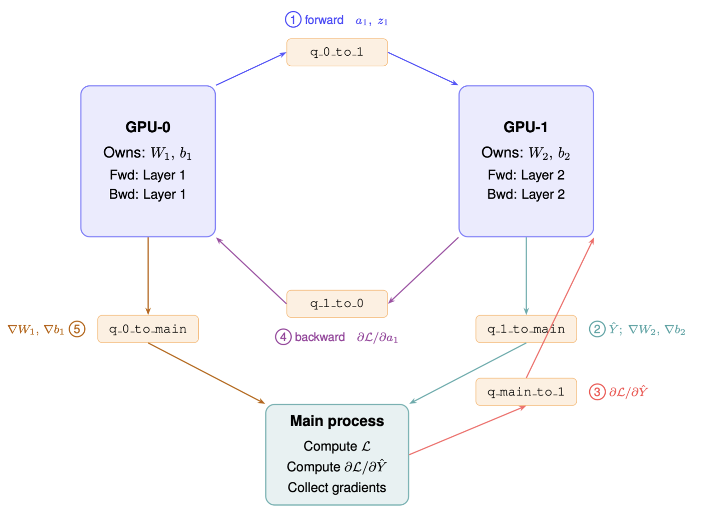

#  Pipeline Parallelism

Distributed training of large neural networks requires splitting computation across multiple GPUs. One widely-used strategy is **pipeline parallelism**: the model is partitioned layer-wise across devices, and activations (forward pass) or gradients (backward pass) are passed between devices over a communication channel. In this assignment, you will implement the missing computation inside two worker processes that together simulate a pipelined two-layer network.

--- 

## Background

### Network Architecture

The network is a two-layer MLP:

| Symbol | Meaning |
|---|---|
| $d_{\text{in}} = 8$ | Input dimension |
| $d_{\text{h}} = 16$ | Hidden dimension |
| $d_{\text{out}} = 4$ | Output dimension |
| $B = 4$ | Batch size |

Given an input $X \in \mathbb{R}^{B \times d_{\text{in}}}$, the two stages compute:

(a) **Layer 1** (runs on GPU-0):

$$
z_1 = X W_1^{\top} + b_1,
\qquad
a_1 = \mathrm{ReLU}(z_1) = \max(0,\,z_1)
\qquad
W_1\in\mathbb{R}^{d_{\text{h}}\times d_{\text{in}}},\;
b_1\in\mathbb{R}^{d_{\text{h}}}
$$

(b) **Layer 2** (runs on GPU-1):

$$
\hat{Y} = a_1 W_2^{\top} + b_2
\qquad
W_2\in\mathbb{R}^{d_{\text{out}}\times d_{\text{h}}},\;
b_2\in\mathbb{R}^{d_{\text{out}}}
$$

The **MSE loss** is computed by the coordinator (Main process):

$$
\mathcal{L}
= \frac{1}{B \cdot d_{\text{out}}}
  \sum_{i=1}^{B}\sum_{k=1}^{d_{\text{out}}}
  \bigl(\hat{Y}_{ik} - Y_{ik}\bigr)^{2}
= \texttt{mean}\!\left((\hat{Y}-Y)^{2}\right)
$$

### Processes and Queues

The simulation uses three Python processes communicating through `multiprocessing.Queue` objects, which serve as the inter-GPU sync primitive (analogous to `NCCL` send/recv on real hardware).

| Process | Owns | Responsibility |
|---|---|---|
| `GPU-0` | $W_1,\,b_1$ | Layer-1 forward; Layer-1 backward |
| `GPU-1` | $W_2,\,b_2$ | Layer-2 forward; Layer-2 backward |
| `Main` | --- | Loss computation; gradient collection |

Five queues carry messages between the processes:

| Queue | Direction | Payload |
|---|---|---|
| `q_0_to_1` | GPU-0 $\to$ GPU-1 | Forward activation $a_1$ + pre-activation cache $z_1$ |
| `q_1_to_main` | GPU-1 $\to$ Main | Model output $\hat{Y}$; then Layer-2 parameter gradients |
| `q_main_to_1` | Main $\to$ GPU-1 | Loss gradient $\partial\mathcal{L}/\partial\hat{Y}$ |
| `q_1_to_0` | GPU-1 $\to$ GPU-0 | Gradient $\partial\mathcal{L}/\partial a_1$ |
| `q_0_to_main` | GPU-0 $\to$ Main | Layer-1 parameter gradients |

Each queue message is a Python tuple beginning with a tag string (e.g. `TAG_ACT`, `TAG_OUTPUT`) so the receiver can assert it got the correct message type. The execution timeline is:

1. GPU-0 runs Layer-1 forward $\to$ sends $(a_1, z_1)$ to GPU-1.
2. GPU-1 receives $a_1$, runs Layer-2 forward $\to$ sends $\hat{Y}$ to Main.
3. Main computes $\mathcal{L}$ and $\partial\mathcal{L}/\partial\hat{Y}$ $\to$ sends the gradient to GPU-1.
4. GPU-1 runs Layer-2 backward $\to$ sends $(\nabla W_2, \nabla b_2)$ to Main and $\partial\mathcal{L}/\partial a_1$ to GPU-0.
5. GPU-0 receives $\partial\mathcal{L}/\partial a_1$, runs Layer-1 backward $\to$ sends $(\nabla W_1, \nabla b_1)$ to Main.
6. Main collects all gradients.



Please refer to task 1 for details on backpropagation. All helper functions (`linear_fwd`, `linear_bwd`, `relu`, `relu_grad`) are already implemented and available to both worker functions.

## Task

Open `student.py` and complete the `# TODO` blocks in layer 1 forward/backward and layer 2 forward/backward. The code structure is already set up for you, and the necessary helper functions are defined in `student.py`.

**Constraints:** Use only `numpy` operations and the helper functions already defined. Do not modify any code outside the four `TODO` blocks, and do not add new queues or processes.

## Testing

The `check_correctness` function at the bottom of `student.py` compares the serial baseline and the pipeline run. Run the tests with:

```
python3 student.py
```
